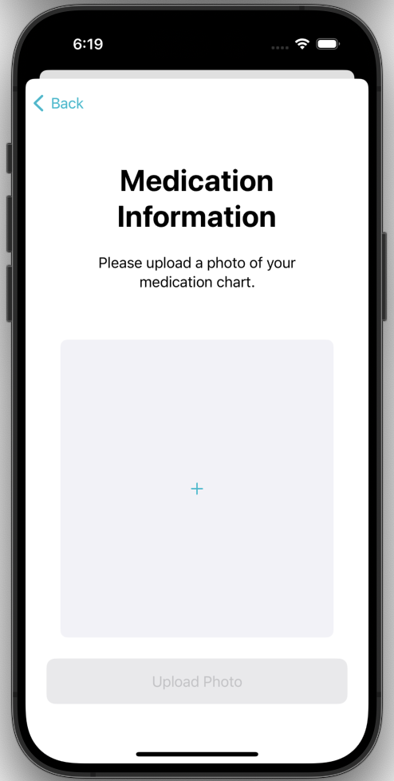
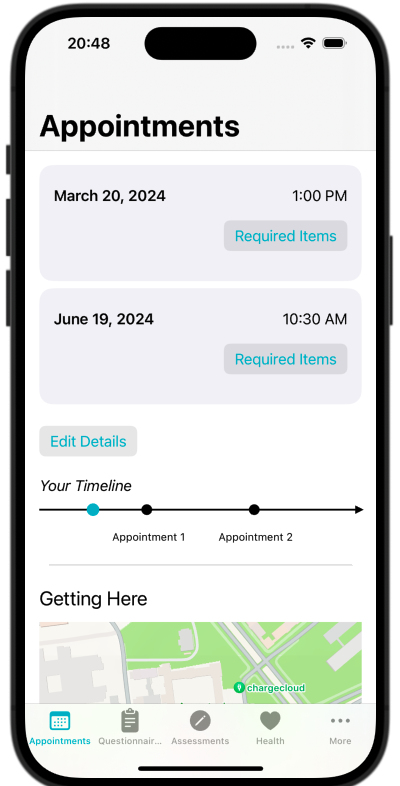
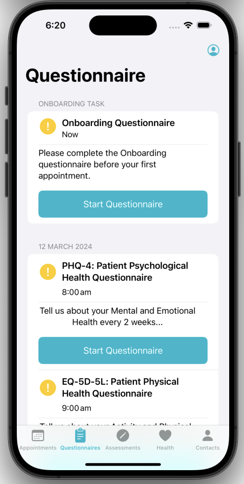
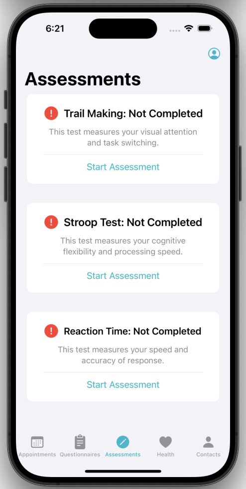
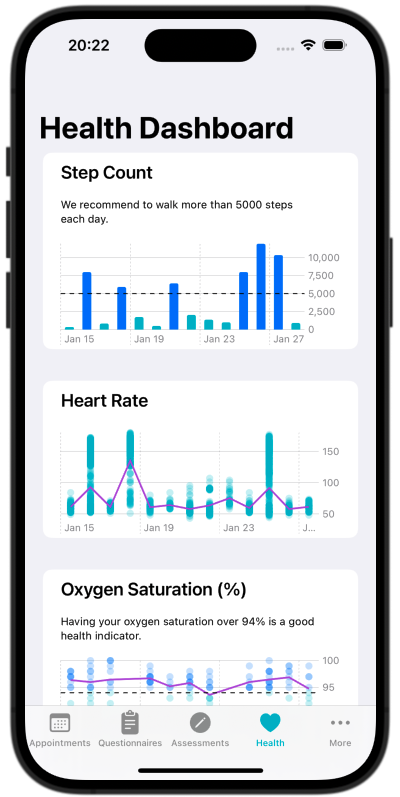
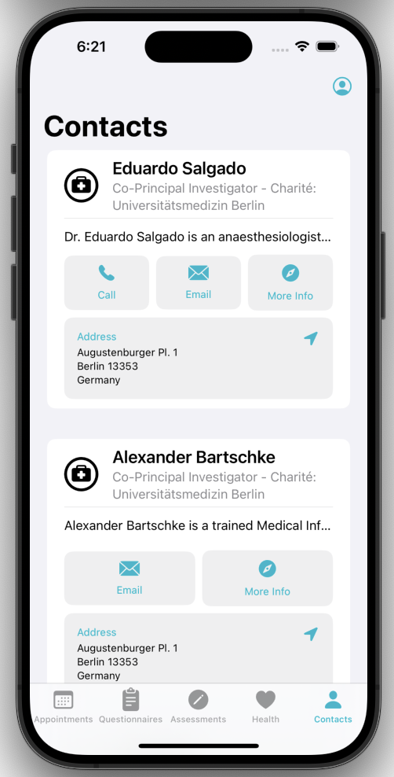

<!--

This source file is part of the PICS based on the Stanford Spezi Template Application project

SPDX-FileCopyrightText: 2024 Stanford University

SPDX-License-Identifier: MIT

-->

# CS342 2024 PICS

This repository contains the CS342 2024 PICS application.
The CS342 2024 PICS application is using the [Spezi](https://github.com/StanfordSpezi/Spezi) ecosystem and builds on top of the [Stanford Spezi Template Application](https://github.com/StanfordSpezi/SpeziTemplateApplication).

> [!NOTE]  
> Do you want to try out the CS342 2024 PICS application? You can download it to your iOS device using [TestFlight](https://testflight.apple.com/join/oHPpBoKG)!

## Overview
The CS342 2024 PICS application allows patients recovering from intensive care therapy to better track their recovery and inform their doctors on their health. Patients fill out necessary hospital questionnaire through the application prior to their hospital visit and track their health vitals based on their Apple health data, as well as plan and prepare for their appointments. 

## CS342 2024 PICS Features
Our application first allows users to create an account to help keep track of their information which includes taking an onboarding questionnaire to collect their basic information, uploading a photo of their medication plan, and entering their appointment information during the onboarding process. Once users have created an account, there are five main features. 

1. Appointments: Users can view their appointment time and the required documents to bring for each of their appointments in the form of interactive checklists. Users can also edit the appointment times in this view, and corresponding notifications will be sent 1 month, 1 week, 3 days, 1 day, and 30 minutes earlier, as well as at the time of the appointment to remind users of their upcoming appointments. There is also a map with the address at the bottom of the view to visualize the location of the appointments to help users navigate.

2. Questionnaires: Users can take the 3 main questionnaires required for each appointment directly through this app on their phone, when they navigate to the Questionnaires tab. This page helps users attempt the questionnaires in a structured manner at specific 5-minute intervals every two weeks. The UI of each task changes according to the completion state: the questionnaire task shows an incomplete yellow exclamation symbol and supporting text suggestion if the questionnaires are incomplete, and a green check mark and appropriate text if the questionnaires are completed. Besides this, if the users choose to skip the onboarding questionnaire during the onboarding process, this onboarding questionnaire will also show up in this tab. Once each questionnaire is started, one question appears per screen, and selecting an option and pressing the bottom button allows you to navigate to the next question.

3. Assessments: Users can take assessments to measure their cognitive abilities. Our application includes the trail-making test, Stroop test, and reaction time test to measure different aspects of the user's cognitive skills. Results will be displayed as a chart and users can click on a dot to see more details about the selected result. Otherwise, our app will show the user's last test result for each test.

4. Health Vitals: Users can view their health vitals (step counts, oxygen saturation, and heart rate) in the previous two weeks. Related details will be shown when users click on a specific bar or dot in the chart for users to learn more about their health condition. Besides, thresholds are set and shown as horizontal lines for step counts and oxygen saturation to facilitate users' understanding of their health vitals.

5. Contacts: This page shows the contact information for the medical team and address information. The PICS app will direct users to the Apple Map for easier direction and navigation when users click on the address.

|<picture><source media="(prefers-color-scheme: dark)" srcset="Resources/MedicationView~dark.png"></picture>|<picture><source media="(prefers-color-scheme: dark)" srcset="Resources/AppointmentView~dark.png"></picture>|<picture><source media="(prefers-color-scheme: dark)" srcset="Resources/QuestionnaireView~dark.png"></picture>|
|:--:|:--:|:--:|
|`Medication View`|`Appointments View`|`Questionniare View`|

|<picture><source media="(prefers-color-scheme: dark)" srcset="Resources/AssessmentView~dark.png"></picture>|<picture><source media="(prefers-color-scheme: dark)" srcset="Resources/HealthDashboardView~dark.png"></picture>|<picture><source media="(prefers-color-scheme: dark)" srcset="Resources/ContactsView~dark.png"></picture>|
|:--:|:--:|:--:|
|`Assessments View`|`Health Vitals View`|`Contacts View`|

## Setup
1. See setup [instructions](https://spezi.health/SpeziTemplateApplication/documentation/templateapplication/setup/) for Spezi Application

## Contributing

Akanshya Bhat
- Appointments page: Homepage design, send notifications, show appointment details, map location (can-have), timeline, required documents, edit appointment information
- Assessment page: Starting code for assessments (trail-making task)
- Contacts page: Set up the screen with information of the PIs
- Testing: Unit and UI tests for the Appointments and Contacts pages

Catherine Zhang:
- Onboarding Questionnaire: Create onboarding questionnaire that is optional during onboarding but must be completed on the dashboard before first appointment
- Medication Information: Create page on the onboarding flow that allows users to upload a photo of the medication sheet received at the hospital
- ReactionTime Assessment: Added the ReactionTime assessment to the assessment page using ResearchKit
- Testing: UI tests for the Onboarding Flow

Karan Soin
- Questionnaires Page: UI set up and refinement for the questionnaires page. Questionnaires Scheduler to schedule the questionnaires at appropriate times, intervals, and allowing patients to retake tests if any errors occurred.
- Assessment Tasks: Added the Stroop Test, UI Revamp for the page and all three Assessment Tests, and refinement of code, comments and overall UI
- Testing: Both UI and Unit tests for code coverage of the the Questionnaires and Scheduler for tasks, setup initial Assessments testing 

Yuren Sun:
- Health Vitals Page: Health dashboard page set up and refinement. HealthKit samples collection and health data visualization for step count, heart rate, and oxygen saturation
- Assessment Page: Basic UI and logic set-up of the page, assessment result parsing for Trail-making and Stroop, and visualization of results
- Testing: Unit and UI tests for the Onboarding Flow, HealthKit Vitals page, and Assessment pages

## License

This project is licensed under the MIT License. See [Licenses](LICENSES) for more information.
