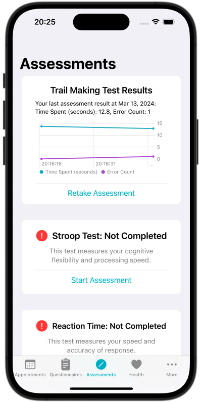

<!--

This source file is part of the PICS based on the Stanford Spezi Template Application project

SPDX-FileCopyrightText: 2023 Stanford University

SPDX-License-Identifier: MIT

-->

# CS342 2024 PICS

This repository contains the CS342 2024 PICS application.
The CS342 2024 PICS application is using the [Spezi](https://github.com/StanfordSpezi/Spezi) ecosystem and builds on top of the [Stanford Spezi Template Application](https://github.com/StanfordSpezi/SpeziTemplateApplication).

> [!NOTE]  
> Do you want to try out the CS342 2024 PICS application? You can download it to your iOS device using [TestFlight](https://testflight.apple.com/join/oHPpBoKG)!

## Overview
The CS342 2024 PICS application allows patients recovering from intensive care therapy to better track their recovery and inform their doctors on their health. Patients fill out necessary hospital questionnaire through the application prior to their hospital visit and track their health vitals based on their Apple health data. 

## CS342 2024 PICS Features
Our application first allows users to create an account to help keep track of their information which includes taking an onboarding questionnaire to collect their basic information as well as uploading a photo of their medication plan during the onboarding process. Once users have created an account, there are five main features. 
1. Appointments

2. Questionnaires

3. Assessments

4. Health Vitals

5. Contacts

|<picture><source media="(prefers-color-scheme: dark)" srcset="Resources/MedicationView~dark.png"></picture>|<picture><source media="(prefers-color-scheme: dark)" srcset="Sources/SpeziLLMLocalDownload/SpeziLLMLocalDownload.docc/Resources/LLMLocalDownload~dark.png"></picture>|<picture><source media="(prefers-color-scheme: dark)" srcset="Resources/QuestionnaireView~dark.png"></picture>|
|:--:|:--:|:--:|
|`Medication View`|`Appointments View`|`Questionniare View`|

|<picture><source media="(prefers-color-scheme: dark)" srcset="Resources/AssessmentView~dark.png"></picture>|<picture><source media="(prefers-color-scheme: dark)" srcset="Sources/SpeziLLMLocalDownload/SpeziLLMLocalDownload.docc/Resources/LLMLocalDownload~dark.png"></picture>|<picture><source media="(prefers-color-scheme: dark)" srcset="Resources/ContactView~dark.png"></picture>|
|:--:|:--:|:--:|
|`Assessments View`|`Health Vitals View`|`Contacts View`|
 
*Provide a comprehensive description of your application, including figures showing the application. You can learn more on how to structure a README in the [Stanford Spezi Documentation Guide](https://swiftpackageindex.com/stanfordspezi/spezi/documentation/spezi/documentation-guide)*

> [!NOTE]  
> Do you want to learn more about the Stanford Spezi Template Application and how to use, extend, and modify this application? Check out the [Stanford Spezi Template Application documentation](https://stanfordspezi.github.io/SpeziTemplateApplication)

## Setup
1. Setup [instructions](https://spezi.health/SpeziTemplateApplication/documentation/templateapplication/setup/) for Spezi Application
## Contributing

Catherine Zhang:
- Onboarding Questionnaire: Create onboarding questionnaire that is optional during onboarding but must be completed on the dashboard before first appointment
- Medication Information: Create page on the onboarding flow that allows users to upload a photo of the medication sheet received at the hospital
- ReactionTime Assessment: Added the ReactionTime assessment to the assessment page using ResearchKit

## License

This project is licensed under the MIT License. See [Licenses](LICENSES) for more information.
